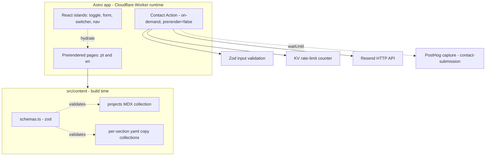
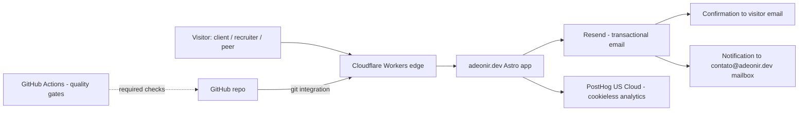
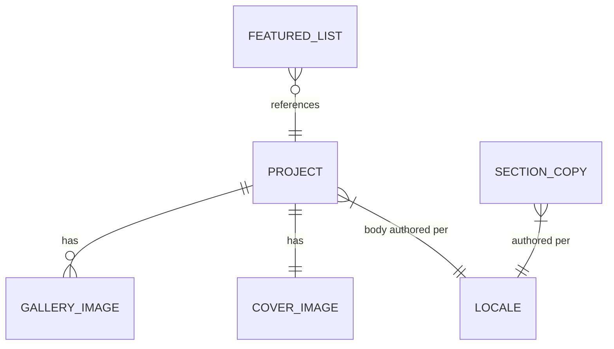

# Design Doc: adeonir.dev Personal Portfolio

## 1. Context & Scope

adeonir.dev is a bilingual (Portuguese default, English secondary) personal
portfolio for a frontend developer positioned on "design + code". It is a
content-first static site — a landing surface, a work index, and per-project
case studies — with a single server touchpoint: a contact form. Performance is
the explicit differentiator: the site itself is the proof of craft, so the
architecture optimizes for near-zero shipped JavaScript and top quality scores.

The surrounding landscape is intentionally small: Cloudflare hosts and runs the
one on-demand route, Resend delivers transactional email, a Plesk-hosted
mailbox on the domain receives the branded inbox, and PostHog collects cookieless,
privacy-first analytics. There is no database and no backend beyond contact
handling.

> See PRD: `docs/product/prd.md`

---

## 2. Goals / Non-Goals

### Goals

- **Performance budget (enforced in CI):** mobile Lighthouse Performance ≥ 95,
  Accessibility 100, Best Practices 100, SEO 100; LCP < 2.0s, CLS < 0.1,
  INP < 200ms. Builds fail when a budget regresses (NFR-1).
- **Near-zero baseline JS:** pages prerender to static HTML; only interactive
  islands hydrate (theme toggle, contact form, language switcher, mobile nav).
- **Accessibility:** WCAG 2.1 AA across all pages, asserted automatically
  (NFR-2).
- **Bilingual-ready delivery:** routing-based i18n (pt at `/`, en at `/en`) with
  localized metadata and `hreflang`. Portuguese ships first; English is a later
  phase (FR-12 is Could Have), so the architecture is built i18n-aware but the en
  locale is enabled once its content is ready (NFR-4).
- **Contact path integrity:** server-side validated submission, two
  transactional emails per submit, spam-guarded, zero persistence; on failure
  the UI surfaces a direct fallback channel (FR-5, EC-2).
- **Safe delivery:** production publishes only from a green, branch-protected
  `main` (CI quality gates are required checks); every PR gets an automatic
  preview deployment.

### Non-Goals

- **Client-side / runtime language switching** (react-i18next style): rejected —
  it would ship both languages plus a translation layer to the client, breaking
  the performance budget and SEO/hreflang.
- **Persistence layer:** no database; contact submissions are transient.
- **Authentication / sessions:** no logged-in experience.
- **SSR for content pages:** content pages are prerendered; only the contact
  route renders on demand.
- **Browser-language auto-detection:** default is pt; language is changed via an
  explicit switcher.

---

## 3. Architecture

### 3.1 Architecture

- **Components:** Astro app (prerendered pages + one on-demand Action), React
  islands, content layer (MDX projects + per-section yaml copy), shared `schemas.ts`.
- **Runtime boundaries:** everything prerenders to static assets except the
  contact Action, which executes on the Cloudflare Worker runtime (workerd).

### 3.2 System Context

- **Actors:** site visitors (the three PRD personas).
- **External services:** Cloudflare Workers (host + edge runtime, git-integration
  build and deploy), Resend
  (outbound transactional email), a Plesk-hosted mailbox on `adeonir.dev`
  (inbound `contato@adeonir.dev`), PostHog US Cloud (cookieless analytics — manual
  capture, server-side `contact-submission` event), GitHub Actions (CI quality
  gates).

### 3.3 Conventions

- **Files / naming:** all files `kebab-case`; component default export is
  `PascalCase` (`project-card.astro` → `ProjectCard`). Slugs and folders
  `kebab-case`. Routes lowercase.
- **Routing:** `/` (pt home), `/work`, `/work/[slug]`, `/404`; English mirrors
  under `/en/...`. `i18n.routing.prefixDefaultLocale = false`.
- **i18n keys vs tags:** locale keys are `pt` (default, bare) and `en`; emitted
  `lang`/`hreflang` are `pt-BR` and `en` (decoupled from the key). Localized
  links built via `getRelativeLocaleUrl()`.
- **Content layout:** per-section yaml copy collections and a `projects` MDX
  collection live under `src/content/`; default locale is bare (`*.yaml`,
  `index.mdx`), English carries an `.en` suffix (`*.en.yaml`, `index.en.mdx`);
  cover and gallery images are shared across locales.
- **Action contract:** Zod input schema; typed, structured errors; the form posts
  to the on-demand `/contact` route, which runs the Action server-side (Resend,
  secrets, KV) and renders server-side success/error states; the island enhances
  submit UX.
- **Styling:** Tailwind consuming the existing dual-skin design tokens.
- **Versioning:** N/A — no public API to version.

### 3.4 Domain

- **Bounded contexts:** two — _content_ (projects + section copy, build-time,
  read-only) and _contact_ (transient inbound message, runtime, write-only to
  email).

| Entity | Purpose | Key Invariants | Storage |
|--------|---------|----------------|---------|
| Project | A case study | `slug` = folder name (unique); pt body (`index.mdx`) required, `index.en.mdx` for en; `cover` present | MDX + colocated images in `src/content/projects/<slug>/` (git, build-time) |
| Section copy | UI text per section per locale | each section has a bare pt file and an `.en` variant; shape validated by its own schema | yaml data collections in `src/content/` (git, build-time) |
| Featured selection | Ordered curation for the home page | references existing project slugs; order is preserved | ordered list in `featured.yaml` (copy) |
| Contact submission | Inbound visitor message | `name`/`email`/`message` validated; rate-limited per IP; never stored or logged | none — transient, delivered via Resend |

- **Lifecycle:** projects are shown everywhere on the work index and on the home
  page when present in the featured list — no stored state. A contact submission
  flows: validate → honeypot + rate-limit check → send two emails → discard.
- **Business rules:** see PRD BR-1 (work is the primary action), BR-2 (every
  shown project routes to a detail surface), BR-3 (contact offers a direct
  channel besides the form).

- **Ubiquitous glossary:** _locale_ (pt | en), _island_ (a hydrated React
  component), _section copy_ (UI text for one section, per locale), _project
  entry_ (one MDX case study), _featured_ (ordered home curation).

### 3.5 Security & Compliance

- **Transport and storage:** HTTPS everywhere (Cloudflare). No data at rest —
  nothing is persisted.
- **PII handling:** the contact form collects `name`, `email`, `message`. These
  are validated, used to compose two emails, and discarded — never stored, never
  written to logs. The visitor's email is set as `Reply-To` on the notification
  so replies route back to them.
- **Auth / Authz:** N/A — no accounts, no protected resources.
- **Spam / abuse:** honeypot field + KV rate-limit counter (5 requests / 10 min
  per IP, keyed on `CF-Connecting-IP`, 600s TTL) + Zod validation. The Workers
  Rate Limiting binding was ruled out: its maximum period (60s) cannot express
  the 10-minute window, which a KV counter with a 600s TTL can.
  Cloudflare Turnstile is held in reserve and added only if spam gets through.
- **Audit log:** N/A — no sensitive or stateful operations to audit.
- **Regulatory (LGPD/GDPR):** analytics is cookieless and aggregate and nothing
  is retained, so no consent banner is required; a lightweight privacy notice
  sits near the form ("your message is emailed to me, not stored"). A standalone
  `/privacy` page is deferred.
- **Secrets:** the Resend API key (and any future tokens) live in the Cloudflare
  Worker's environment variables, with `.dev.vars` for local development; never
  committed. Sending domain `adeonir.dev` is verified in Resend via SPF/DKIM/DMARC
  records in Cloudflare DNS.

### 3.6 Observability

- **Metrics:** PostHog US Cloud (`us.i.posthog.com`), hardened cookieless —
  `cookieless_mode: 'always'` (server-side daily-salt hash identity; unique
  counts are effectively per-day as the salt rotates), `persistence: 'memory'`,
  `autocapture: false`, `disable_session_recording: true`, `respect_dnt: true`;
  loaded async and direct (no reverse proxy), off the LCP critical path. All
  events are manual: pageviews, button/CTA clicks, and form interactions
  (client), plus `contact-submission` — a standalone conversion count (not
  joined to the visitor funnel) captured **server-side in the contact Action**
  via a direct `fetch` to the capture endpoint, keeping the count server-authoritative
  and free of client double-firing. The event carries name + UTM/source only — no
  form PII — and fires non-blocking via `waitUntil`, isolated from the Resend
  send so analytics never blocks or breaks submission. UTM source/medium/campaign
  attribution (FR-9). posthog-js core is heavier than Umami; with autocapture
  and session recording off the heavy chunks lazy-load out — confirm the real
  shipped size against the perf budget (§2) before locking the lib.
- **Logging:** Cloudflare Worker logs capture contact Action errors (no PII);
  Resend's dashboard records delivery status. The site is otherwise static and
  log-free.
- **Alerts:** N/A for paging — this is a personal site. Delivery failure is
  surfaced to the visitor in-band (EC-2 fallback to the direct channel) and
  visible in the Resend dashboard.
- **Dashboards:** PostHog dashboard (owner) for traffic and goals.
- **Tracing:** N/A — a single edge function with no downstream call graph.

### 3.7 Testing

| Type | Scope | Tools | Coverage Target |
|------|-------|-------|-----------------|
| Unit | Input validation, email template helper, form hook, theme store | Vitest — plain config + `vite-tsconfig-paths`; node default, happy-dom per spec | Core logic |
| Component | React islands (toggle, form, switcher) in a real browser | Vitest browser mode (Playwright provider) | Each island |
| E2E | Contact flow + EC-2 fallback, routing, 404 (EC-3) | Playwright | Critical flows |
| A11y | Rendered pages, WCAG AA | `@axe-core/playwright` | All pages |
| Perf / budget | Quality budgets (see §2) | Lighthouse CI | Key pages |

- **Test environments:** local, plus per-PR Cloudflare preview deployments.
- **Flake handling:** Playwright retries on CI; deterministic selectors.
- **CI integration:** all suites run in GitHub Actions on every PR as required
  status checks; branch protection blocks merge to `main` on failure (see §3.8).
- **Unit suite (built):** `pnpm test` (`vitest run`) covers the units above in node +
  happy-dom; it runs locally, on pre-push (lefthook), and as the required `Unit Tests` CI
  check. The Component, E2E, and A11y rows remain planned.

### 3.8 Deployment

- **CI (quality gates):** GitHub Actions on every PR — install → lint (Biome) →
  typecheck → Vitest (+ browser mode) → Playwright → Lighthouse CI → build. The
  jobs are required status checks and grow as tooling lands: lint, typecheck, and
  build first; the unit, e2e, a11y, and budget suites as the pages and suites
  exist. No deploy step runs in Actions.
- **Deploy:** Cloudflare Workers Builds git integration builds and publishes — a
  push to `main` runs `pnpm build` then `npx wrangler deploy` for production, with
  an automatic preview deployment per branch/PR. No Cloudflare credentials live
  in GitHub.
- **Safety:** branch protection on `main` makes the CI checks required, so a red
  branch cannot merge and Cloudflare only ever builds a green `main`; admin
  bypass stays enabled for emergencies.
- **Local quality gate:** lefthook runs format and lint on staged files at
  pre-commit, blocking the commit on violation — a fast local mirror of the CI
  lint/format step so a red tree never reaches CI.
- **Release strategy:** production deploys from `main`; every PR/branch gets an
  automatic preview deployment via the git integration.
- **Rendering:** static prerender for all content pages; the contact route is
  `export const prerender = false` and runs on the Cloudflare Worker runtime.
- **Migrations:** N/A — no database.
- **Backups:** all content (MDX + yaml + images) is versioned in git; there is
  no separate data store to back up.
- **Rollback:** redeploy the previous build, or roll back to a prior deployment
  from the Cloudflare Workers dashboard.
- **Environments:** local (`.dev.vars`), PR preview, production.
- **Secrets management:** Cloudflare Worker environment variables hold the Resend
  key and per-environment runtime config (production vs preview). No Cloudflare
  credentials in GitHub — the git integration deploys, so Actions holds no deploy
  secrets.

---

## 4. Alternatives Considered

| Decision | Chosen | Rejected | Reasoning | Record |
|----------|--------|----------|-----------|--------|
| Framework | Astro (hybrid) | TanStack Start | Content-first site where performance is the message; TanStack Start is an app framework solving a content problem — its loaders/server-fns are app features this site does not need | — |
| Host / rendering | Cloudflare Workers (static assets today, on-demand contact Action planned) | Vercel / Netlify; fully static | Free edge hosting on the workerd runtime with a native ecosystem (KV, per-branch preview URLs); ships as static assets now, with the contact Action the one planned on-demand route while everything else prerenders. Vercel/Netlify are equally capable; fully static would force the form onto a third party | — |
| Deploy pipeline | Cloudflare Workers Builds git integration | Wrangler deploy job in GitHub Actions | Solo, deterministic static build: the git integration runs `pnpm build` + `wrangler deploy` on push, giving automatic per-branch previews, dashboard rollback, and per-environment vars with zero deploy credentials in GitHub. Quality gates run in Actions as required checks and branch protection keeps `main` green, so red never reaches production — the artifact-parity edge of an in-pipeline deploy job doesn't justify rebuilding that DX by hand | — |
| Contact delivery | Resend (2 emails) | CF Email Routing send-binding; D1 persistence | The flow must email the _visitor_ (arbitrary address) — the send-binding can only reach verified self-addresses; no DB needed since emails are the record | — |
| Spam defense | Honeypot + KV rate-limit counter | Workers Rate Limiting binding; Turnstile from day one | The binding's max period (60s) cannot express the 5 req / 10 min rule — a KV counter with 600s TTL can, and eventual consistency is acceptable for a low-volume personal form. Turnstile adds a script + widget that costs perf — reserved until spam is proven | — |
| UI runtime | React 19 (`@astrojs/react`) | Preact; Preact + `preact/compat` shim | Ark UI is the primitives layer and ships no Preact flavor; the compat route failed SSR in practice (`document` access under `preact-render-to-string`). Runtime cost (~50kb gzip on hydrating viewports) is deferred via `client:*` and guarded by the Lighthouse CI budget | ADR-001 |
| Styling | Tailwind | Vanilla CSS; CSS Modules | Existing dual-skin tokens map cleanly to generated utilities; first-class Astro integration | — |
| Theme switching | `data-theme` attribute (dark default) | `.dark` class + Tailwind `dark:` variant; `@media (prefers-color-scheme)` only | Tokens already resolve from `[data-theme=light]`; `.dark` inverts the dark-first identity and forces a token-layer rewrite, and media-query-only theming can't express an explicit user override | ADR-002 |
| Island state | Nano Stores (`@nanostores/react`) | React Context; prop drilling; Zustand/Jotai/Redux | Context can't cross island hydration roots (separate React trees); nanostores is ~1kb, framework-agnostic, and the Astro-recommended cross-island state layer | ADR-003 |
| SSR-safe islands | Ark `ClientOnly` + CSS fallback + DOM-seeded atom | useEffect-after-hydration; pure-CSS icon; SSR from a theme cookie | An island's first paint can't read client-resolved state at build time; the fallback paints the resolved UI before hydration while the stateful primitive (Swap + rotate) loads on the client | ADR-004 |
| Content model | Single-source MDX + per-section yaml collections | Split metadata (yaml) from body (MDX) | One source of truth per project; schema-validated; no slug duplication or join logic | — |
| i18n strategy | Routing-based: pt bare, en `/en`, no auto-detect | Client-side (react-i18next style); both-locales-prefixed; browser detection | Keeps the perf budget and SEO/hreflang intact; clean prefix-free URL for the primary (BR) audience | — |
| Analytics | PostHog US Cloud (cookieless) | Umami Cloud; Cloudflare Web Analytics | Privacy-first is the driver: PostHog's cookieless mode (daily-salt hash identity, memory persistence, autocapture + session recording off, DNT respected) delivers custom events and UTM in one privacy-first config, plus server-side `contact-submission` capture (server-authoritative, no client double-count) — which CF Web Analytics lacks and Umami does not cover. Umami ships lighter, but client weight is held down by manual-only capture; measure the real bundle before locking the lib | — |
| E2E testing | Keep Playwright (scoped) | Drop it | Component tests can't exercise the contact Action, routing, or 404 — the only places that can actually break | — |
| Unit test runner config | Plain `vitest/config` + `vite-tsconfig-paths` | Astro `getViteConfig` | `getViteConfig` loads the full Astro config, whose Cloudflare adapter registers a Vite plugin Vitest rejects at startup; the covered units import no `astro:*` virtuals, so a plain config with the tsconfig `~/` alias suffices | — |
| Pre-commit hook manager | lefthook | husky; simple-git-hooks; native git hooks | Single YAML config, parallel hook execution, language-agnostic Go binary with no Node runtime in the hook path; husky needs more wiring, simple-git-hooks is leaner but less capable, native hooks aren't shareable | — |

**Record column:** `—` means the design doc is the only record. Rows with an
`ADR-NNNN` are frozen — reversals require a superseding ADR.

---

## 5. Open Questions

- None currently.

---

## 6. References

- PRD: `docs/product/prd.md`
- Astro i18n routing: https://docs.astro.build/en/guides/internationalization/
- ADRs: `docs/adr/001-react-islands-runtime.md`
