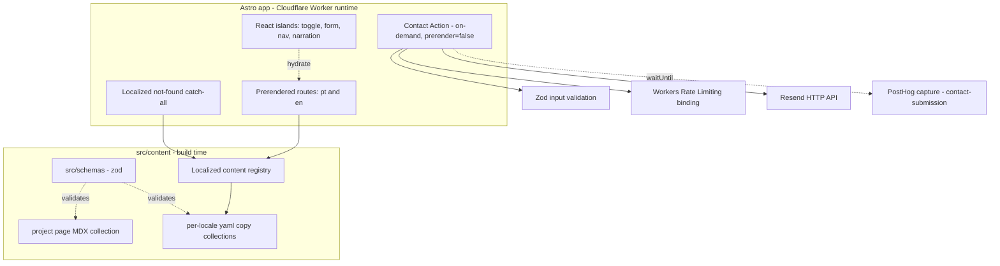
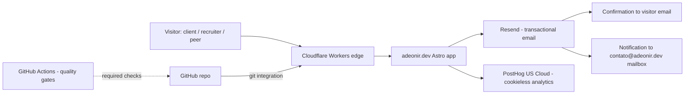
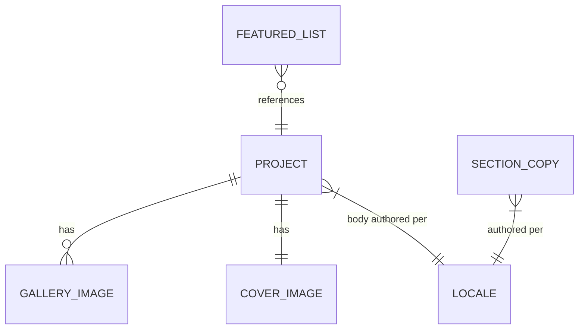

# Design Doc: adeonir.dev Personal Portfolio

## 1. Context & Scope

adeonir.dev is a bilingual (Portuguese default, English under `/en/`) personal portfolio for a frontend developer positioned on "design + code". It is a content-first static site — a landing surface, a work index, and project pages that can contain case studies — with a single server touchpoint: a contact form. Performance is the explicit differentiator: the site itself is the proof of craft, so the architecture uses Astro's static rendering and a deliberate client-JavaScript budget to reach top quality scores.

The home, not-found fallback, and maintenance surfaces are published in both locales. Portuguese keeps the bare URLs and English uses explicit `/en/` entrypoints.

The surrounding landscape is intentionally small: Cloudflare hosts and runs the one on-demand route, Resend delivers transactional email, a Plesk-hosted mailbox on the domain receives the branded inbox, and PostHog collects cookieless, privacy-first analytics. There is no database and no backend beyond contact handling.

> See PRD: `docs/product/PRD.md`

---

## 2. Goals / Non-Goals

### Goals

- **Performance budget (enforced in CI):** mobile Lighthouse Performance ≥ 95, Accessibility 100, Best Practices 100, SEO 100; CLS < 0.1, INP < 200ms. Builds fail when a category score regresses; CLS and the blocking-time proxy for INP report as warnings (NFR-1). LCP under 3s is a nice to have and only warns.
- **Client JavaScript budget:** Astro prerenders normal pages to static HTML. Use client-side JavaScript when an interaction needs it, and keep React hydration limited to the theme toggle, contact form, mobile nav, footer signoff, toaster, and the home narration controls. This budget is not a ban on JavaScript. The localized not-found catch-all remains server-rendered without a client translation layer.
- **Accessibility:** Lighthouse Accessibility 100 on the home, enforced in CI (NFR-2). WCAG AA across all pages is a nice to have, not a gate.
- **Bilingual delivery:** routing-based i18n (pt at `/`, en at `/en`) with localized content and document metadata, `hreflang` alternates, and localized sitemap entries (NFR-4).
- **Contact path integrity:** server-side validated submission, two transactional emails per submit, spam-guarded, zero persistence; on failure the UI surfaces a direct fallback channel (FR-5, EC-2).
- **Safe delivery:** production publishes only from a green, branch-protected `main` (CI quality gates are required checks); every PR gets an automatic preview deployment.

### Non-Goals

- **Client-side / runtime language switching** (react-i18next style): rejected — it would ship both languages plus a translation layer to the client, breaking the performance budget and SEO/hreflang.
- **Persistence layer:** no database; contact submissions are transient.
- **Authentication / sessions:** no logged-in experience.
- **SSR for content pages:** normal content pages are prerendered; the localized not-found catch-all and contact route render on demand.
- **Browser-language auto-detection:** the default locale is pt; the current route determines the rendered locale.

---

## 3. Architecture

### 3.1 Architecture

```mermaid
flowchart TD
  subgraph App[Astro app - Cloudflare Worker runtime]
    Pages[Prerendered routes: pt and en]
    NotFound[Localized not-found catch-all]
    Action[Contact Action - on-demand, prerender=false]
    Islands[React islands: toggle, form, nav, narration]
  end
  subgraph Content[src/content - build time]
    MDX[project page MDX collection]
    Copy[per-locale yaml copy collections]
    Registry[Localized content registry]
    Schemas[src/schemas - zod]
  end
  Pages --> Registry
  NotFound --> Registry
  Registry --> Copy
  Schemas -. validates .-> MDX
  Schemas -. validates .-> Copy
  Islands -. hydrate .-> Pages
  Action --> Zod[Zod input validation]
  Action --> RL[Workers Rate Limiting binding]
  Action --> Resend[Resend HTTP API]
  Action -. waitUntil .-> PostHog[PostHog capture - contact-submission]
```

- **Components:** Astro app (prerendered pages + localized not-found fallback + one on-demand Action), React islands, content layer (MDX project pages + per-locale yaml copy and localized registry), shared `src/schemas/`.
- **Runtime boundaries:** normal pages prerender to static assets. The localized not-found catch-all and contact Action execute on the Cloudflare Worker runtime (workerd).

### 3.2 System Context

```mermaid
flowchart LR
  Visitor[Visitor: client / recruiter / peer] --> CF[Cloudflare Workers edge]
  CF --> App[adeonir.dev Astro app]
  App --> Resend[Resend - transactional email]
  Resend --> Submitter[Confirmation to visitor email]
  Resend --> Inbox[Notification to contato@adeonir.dev mailbox]
  App --> PostHog[PostHog US Cloud - cookieless analytics]
  Repo[GitHub repo] -- git integration --> CF
  GH[GitHub Actions - quality gates] -. required checks .-> Repo
```

- **Actors:** site visitors (the three PRD personas).
- **External services:** Cloudflare Workers (host + edge runtime, git-integration build and deploy), Resend (outbound transactional email), a Plesk-hosted mailbox on `adeonir.dev` (inbound `contato@adeonir.dev`), PostHog US Cloud (cookieless analytics — manual capture, server-side `contact-submission` event), GitHub Actions (CI quality gates).
- **Narration production:** a local script in the repository calls the ElevenLabs API before publication and writes the audio files, which ship with the site's static assets. Neither visits nor builds call ElevenLabs.

### 3.3 Conventions

- **Files / naming:** all files `kebab-case`; component default export is `PascalCase` (`project-card.astro` → `ProjectCard`). Slugs and folders `kebab-case`. Routes lowercase.
- **Routing:** `/` and `/maintenance` are Portuguese routes. English counterparts are explicit files at `/en/` and `/en/maintenance/`. Missing paths use the localized catch-all fallback; there is no dedicated `/en/404` route. `/styleguide` remains an internal noindex route outside the localized route tree. `i18n.routing.prefixDefaultLocale = false`. The not-found copy carries a `paths` map keyed by the first path segment (for example `projects`), each entry holding its own `body` and `action`, so a future surface adds a block without touching the catch-all handler itself.
- **i18n keys vs tags:** locale keys are `pt` (default, bare) and `en`; the document `lang` values are `pt-BR` and `en` (decoupled from the key). `astro-seo`'s `languageAlternates` emits the `hreflang` links (`pt-BR`, `en`, and `x-default` pointing to the Portuguese address) in every page's `<head>`; `@astrojs/sitemap`'s `i18n` option emits the matching localized alternates in the sitemap. Localized links use `getRelativeLocaleUrl()`.
- **Content layout:** per-section YAML copy collections live under `src/content/`, with index copy under `src/content/projects/<locale>/` and project-page copy plus localized MDX entries under `src/content/project/<locale>/`. Images shared by both locales live at `src/assets/projects/<slug>/images/`. The localized registry maps a base collection to its locale-specific collection and fails when the required entry is missing. Settings content also holds locale-specific document metadata and route titles.
- **Action contract:** Zod input schema; typed, structured errors; the form submits through `actions.contact()` to the on-demand Action. A required hidden `locale` field accepts only `pt` or `en`. The Action passes that locale to the email service, which selects the matching copy and date format; the island enhances submit UX.
- **Crawl policy:** the layout marks the 404 and maintenance documents as `noindex`. The sitemap and `robots.txt` filter `/styleguide`, `/maintenance`, and `/en/maintenance` through the shared `noIndexRoutes` list.
- **Styling:** Tailwind consuming the existing dual-skin design tokens.
- **Versioning:** N/A — no public API to version.

### 3.4 Domain

- **Bounded contexts:** two — _content_ (projects + localized section copy, build-time, read-only) and _contact_ (transient inbound message, runtime, write-only to email).

| Entity | Purpose | Key Invariants | Storage |
| --- | --- | --- | --- |
| Project | A project page that can contain a case study | `slug` = file name (unique); one `.mdx` entry per locale; `cover` present | Localized MDX under `src/content/project/<locale>/`; shared images under `src/assets/projects/<slug>/images/` (git, build-time) |
| Section copy | UI text per section per locale | each section has a bare pt file and an `.en` variant; shape validated by its own schema; no locale fallback | yaml data collections in `src/content/` (git, build-time) |
| Featured selection | Ordered curation for the home page | references existing project slugs; order is preserved | ordered list in `featured.yaml` (copy) |
| Contact submission | Inbound visitor message | `name`/`email`/`message` and `locale` (`pt` or `en`) validated; rate-limited per IP; never stored or logged | none — transient, delivered via Resend |

- **Lifecycle:** projects are shown everywhere on the work index and on the home page when present in the featured list — no stored state. A contact submission flows: validate fields and locale → honeypot + rate-limit check → select localized email copy and date format → send two emails → discard.
- **Business rules:** see PRD BR-1 (work is the primary action), BR-2 (every shown project carries a summary; it routes to a detail surface, links out to its site, or is listed as offline), BR-3 (contact offers a direct channel besides the form).

```mermaid
erDiagram
  PROJECT ||--o{ GALLERY_IMAGE : has
  PROJECT ||--|| COVER_IMAGE : has
  FEATURED_LIST }o--|| PROJECT : references
  SECTION_COPY }|--|| LOCALE : "authored per"
  PROJECT }|--|| LOCALE : "body authored per"
```

- **Ubiquitous glossary:** _locale_ (pt | en), _localized content registry_ (the required mapping from a base collection to its locale-specific collection), _island_ (a hydrated React component), _section copy_ (UI text for one section, per locale), _project entry_ (one MDX project page, which can contain a case study), _featured_ (ordered home curation).

### 3.5 Security & Compliance

- **Transport and storage:** HTTPS everywhere (Cloudflare). No data at rest — nothing is persisted.
- **PII handling:** the contact form collects `name`, `email`, `message`. These are validated, used to compose two emails, and discarded — never stored, never written to logs. The visitor's email is set as `Reply-To` on the notification so replies route back to them.
- **Auth / Authz:** N/A — no accounts, no protected resources.
- **Spam / abuse:** honeypot field + the native Workers Rate Limiting binding (`CONTACT_LIMIT`, 5 requests / 60s per IP, keyed on `Astro.clientAddress`) + Zod validation. The binding supports only 10- or 60-second periods, so 60s is the longest window it can express. It fails open: when the binding throws, the request is admitted rather than rejected. Cloudflare Turnstile is held in reserve and added only if spam gets through.
- **Audit log:** N/A — no sensitive or stateful operations to audit.
- **Regulatory (LGPD/GDPR):** analytics is cookieless and aggregate and nothing is retained, so no consent banner is required; a lightweight privacy notice sits near the form ("your message is emailed to me, not stored"). A standalone `/privacy` page is deferred.
- **Secrets:** the Resend API key (and any future tokens) live in the Cloudflare Worker's environment variables, with `.dev.vars` for local development; never committed. Sending domain `adeonir.dev` is verified in Resend via SPF/DKIM/DMARC records in Cloudflare DNS. The narration script reads the ElevenLabs key and voice id from the local `.env` only; neither value belongs in the Astro env schema or the Cloudflare environment.

### 3.6 Observability

- **Metrics:** PostHog US Cloud (`us.i.posthog.com`), hardened cookieless — `cookieless_mode: 'always'` (server-side daily-salt hash identity; unique counts are effectively per-day as the salt rotates), `persistence: 'memory'`, `autocapture: false`, `disable_session_recording: true`, `respect_dnt: true`; loaded async and direct (no reverse proxy), off the LCP critical path. All events are manual: pageviews, button/CTA clicks, form interactions, and narration playback — `narration-started`, `narration-completed`, and `narration-failed`, each with `section` and `locale` (client), plus `contact-submission` — a standalone conversion count (not joined to the visitor funnel) captured **server-side in the contact Action** via a direct `fetch` to the capture endpoint, keeping the count server-authoritative and free of client double-firing. The event carries name + UTM/source only — no form PII — and fires non-blocking via `waitUntil`, isolated from the Resend send so analytics never blocks or breaks submission. UTM source/medium/campaign attribution (FR-9). posthog-js core is heavier than Umami; with autocapture and session recording off the heavy chunks lazy-load out — confirm the real shipped size against the perf budget (§2) before locking the lib.
- **Logging:** Cloudflare Worker logs capture contact Action errors (no PII); Resend's dashboard records delivery status. The site is otherwise static and log-free.
- **Alerts:** N/A for paging — this is a personal site. Delivery failure is surfaced to the visitor in-band (EC-2 fallback to the direct channel) and visible in the Resend dashboard.
- **Dashboards:** PostHog dashboard (owner) for traffic and goals.
- **Tracing:** N/A — a single edge function with no downstream call graph.

### 3.7 Testing

| Type | Scope | Tools | Coverage Target |
| --- | --- | --- | --- |
| Unit | Input validation, localized email rendering, hooks, scripts, services, narration audio sync | Vitest — plain config + `vite-tsconfig-paths`; node default, happy-dom per spec | Pure logic only |
| Perf / budget | Quality budgets (see §2) | Lighthouse CI | Key pages |

Sections and pages carry no automated test — the owner checks them in the browser instead. An earlier attempt rendered Astro sections and React islands through Vitest browser mode and the Astro Container API; both were dropped because a rendered assertion never caught more than a manual pass already would, for the cost of a container setup and a browser runner. Unit coverage stays on pure logic: helpers, hooks, scripts, and services.

- **Test environments:** local, plus per-PR Cloudflare preview deployments.
- **CI integration:** all suites run in GitHub Actions on every PR as required status checks; branch protection blocks merge to `main` on failure (see §3.8).
- **Unit suite (built):** `pnpm test` (`vitest run`) covers the units above in node + happy-dom, including the locale validation and English email contract; it runs locally, on pre-push (lefthook), and as the required `Unit Tests` CI check.

### 3.8 Deployment

- **CI (quality gates):** GitHub Actions on every PR — install → lint (Biome) → typecheck → Vitest (+ browser mode) → Lighthouse CI → build. The jobs are required status checks and grow as tooling lands: lint, typecheck, build, and the unit suite first; the component, a11y, and budget suites as the pages and suites exist. No deploy step runs in Actions.
- **Deploy:** Cloudflare Workers Builds git integration builds and publishes — a push to `main` runs `pnpm build` then `npx wrangler deploy` for production, with an automatic preview deployment per branch/PR. No Cloudflare credentials live in GitHub.
- **Safety:** branch protection on `main` makes the CI checks required, so a red branch cannot merge and Cloudflare only ever builds a green `main`; admin bypass stays enabled for emergencies.
- **Local quality gate:** lefthook runs format and lint on staged files at pre-commit, blocking the commit on violation — a fast local mirror of the CI lint/format step so a red tree never reaches CI.
- **Release strategy:** production deploys from `main`; every PR/branch gets an automatic preview deployment via the git integration.
- **Rendering:** normal content pages prerender to static assets. The localized not-found catch-all and contact Action run on the Cloudflare Worker runtime.
- **Migrations:** N/A — no database.
- **Backups:** all content (MDX + yaml + images) is versioned in git; there is no separate data store to back up.
- **Rollback:** redeploy the previous build, or roll back to a prior deployment from the Cloudflare Workers dashboard.
- **Environments:** local (`.dev.vars`), PR preview, production.
- **Secrets management:** Cloudflare Worker environment variables hold the Resend key and per-environment runtime config (production vs preview). No Cloudflare credentials in GitHub — the git integration deploys, so Actions holds no deploy secrets.

### 3.9 Home Narration

The owner generates narration before publication with a local script in the repository and publishes the files as static assets with the site. Each narrated section has an audio file for each supported locale, selected from the page's locale. See PRD FR-16 for scope, BR-5 for playback rules, BR-6 for the narrated text, and EC-4 for a failed load.

**Production.** The script reads each section's spoken text from the narration content collection and sends it to ElevenLabs with the owner's cloned voice. The spoken text is the narrated text (PRD BR-6) written for listening, with delivery directions and words spelled the way they are spoken. The script writes one MP3 per section and locale as a static asset, named after the hash of its spoken text. MP3 plays in every target browser, and the files are served without a build step.

ElevenLabs is a content-production dependency. Playback and site builds use the committed files without contacting the provider, and the site runtime needs no ElevenLabs SDK, API key, or synthesis endpoint; only the local script holds the key (§3.5). A provider outage blocks new recordings but does not affect files already published.

**Text and audio sync.** A unit test hashes each current spoken text and fails when the file with that name is missing, so a changed spoken text cannot ship with stale audio. The test does not compare the spoken text with the page, because the two differ on purpose: a copy change to a narrated section updates its spoken text in the same change, and the owner listens to every regenerated file before publishing. Text and audio ship in the same commit so a rollback restores both.

**Playback.** Each narrated section mounts its own React island. A nanostores atom holds the section that is playing (ADR-003); starting one section sets the atom, and the other islands pause. No audio downloads until the visitor starts a narration. A paused section keeps its position; a finished one resets to the start. A failed load raises a toast through the toaster the layout shares with the contact form, and returns the control to idle while the text stays on the page. The control is an accessible toggle button with a fixed visible label, and its copy lives in a per-locale content collection.

---

## 4. Alternatives Considered

| Decision | Chosen | Rejected | Reasoning | Record |
| --- | --- | --- | --- | --- |
| Narration delivery | Pre-generated ElevenLabs audio published as static assets | Synthesis during visits or builds | Fixed section text can be recorded before publication; visits and builds remain independent of the provider. Text changes require regenerating and publishing the matching audio | — |
| Narration source | An authored spoken text per section and locale | Text derived from the page copy | Delivery directions and pronunciation fixes cannot be derived from the page text; the cost is keeping each spoken text in step with its section's copy by hand | — |
| Narration generation | Repository script calling the ElevenLabs API | Manual export from the ElevenLabs dashboard | Regenerating after a spoken text change is one command and touches only the sections that changed; the cost is a script to maintain and an API key in the local `.env` | — |
| Narration asset location | Files in `public/` named after the hash of their spoken text | Stable, unhashed paths in `public/`; imported from `src/assets` | A new name on every regeneration keeps a cached older file from being served, and the name itself records which spoken text the file came from; the build computes the same name to link each section to its file | — |
| Narration text sync | Unit test that the file for each current spoken text exists | A hash manifest; comparing the spoken text with the page; manual regeneration only | A spoken text edit without new audio fails the required `Unit Tests` check; comparing with the page would fail on every delivery direction and pronunciation fix | — |
| Narration controls | One React island per section plus a shared nanostores atom | One vanilla script over Astro-rendered buttons | Matches the island and state layer already in place (ADR-001, ADR-003) and reuses the Ark primitives; the cost is three extra hydrating islands on the home | — |
| Framework | Astro (hybrid) | TanStack Start | Content-first site where performance is the message; TanStack Start is an app framework solving a content problem — its loaders/server-fns are app features this site does not need | — |
| Host / rendering | Cloudflare Workers (prerendered static assets plus on-demand routes) | Vercel / Netlify; fully static | Free edge hosting on the workerd runtime with a native ecosystem (KV, per-branch preview URLs); content pages prerender to static assets, while the contact Action and the localized not-found catch-all run on demand. Vercel/Netlify are equally capable; fully static would force the form onto a third party | — |
| Deploy pipeline | Cloudflare Workers Builds git integration | Wrangler deploy job in GitHub Actions | Solo, deterministic static build: the git integration runs `pnpm build` + `wrangler deploy` on push, giving automatic per-branch previews, dashboard rollback, and per-environment vars with zero deploy credentials in GitHub. Quality gates run in Actions as required checks and branch protection keeps `main` green, so red never reaches production — the artifact-parity edge of an in-pipeline deploy job doesn't justify rebuilding that DX by hand | — |
| Contact delivery | Resend (2 emails) | CF Email Routing send-binding; D1 persistence | The flow must email the _visitor_ (arbitrary address) — the send-binding can only reach verified self-addresses; no DB needed since emails are the record | — |
| Spam defense | Honeypot + Workers Rate Limiting binding | KV rate-limit counter; Turnstile from day one | The binding needs no read-modify-write and no TTL bookkeeping, and 5 req / 60s is enough for a low-volume personal form; its 10s/60s period limit is the cost. Turnstile adds a script + widget that costs perf — reserved until spam is proven | — |
| UI runtime | React 19 (`@astrojs/react`) | Preact; Preact + `preact/compat` shim | Ark UI is the primitives layer and ships no Preact flavor; the compat route failed SSR in practice (`document` access under `preact-render-to-string`). Runtime cost (~50kb gzip on hydrating viewports) is deferred via `client:*` and guarded by the Lighthouse CI budget | ADR-001 |
| Styling | Tailwind | Vanilla CSS; CSS Modules | Existing dual-skin tokens map cleanly to generated utilities; first-class Astro integration | — |
| Theme switching | `data-theme` attribute (dark default) | `.dark` class + Tailwind `dark:` variant; `@media (prefers-color-scheme)` only | Tokens already resolve from `[data-theme=light]`; `.dark` inverts the dark-first identity and forces a token-layer rewrite, and media-query-only theming can't express an explicit user override | ADR-002 |
| Island state | Nano Stores (`@nanostores/react`) | React Context; prop drilling; Zustand/Jotai/Redux | Context can't cross island hydration roots (separate React trees); nanostores is ~1kb, framework-agnostic, and the Astro-recommended cross-island state layer | ADR-003 |
| SSR-safe islands | Ark `ClientOnly` + CSS fallback + DOM-seeded atom | useEffect-after-hydration; pure-CSS icon; SSR from a theme cookie | An island's first paint can't read client-resolved state at build time; the fallback paints the resolved UI before hydration while the stateful primitive (Swap + rotate) loads on the client | ADR-004 |
| Content model | Per-locale project MDX + shared project images + per-locale section yaml collections | Locale-suffixed files in one project folder; duplicated images inside locale folders; nested locale fields | Locale-first paths match the other content collections and preserve independent entries without duplicating shared images | ADR-005 |
| i18n strategy | Routing-based: pt bare, en `/en`, explicit route files, no auto-detect or fallback | Client-side (react-i18next style); both-locales-prefixed; browser detection; Astro `i18n.fallback` | Keeps the perf budget and prevents Portuguese content at English URLs. Explicit files make the small supported route set visible | — |
| Analytics | PostHog US Cloud (cookieless) | Umami Cloud; Cloudflare Web Analytics | Privacy-first is the driver: PostHog's cookieless mode (daily-salt hash identity, memory persistence, autocapture + session recording off, DNT respected) delivers custom events and UTM in one privacy-first config, plus server-side `contact-submission` capture (server-authoritative, no client double-count) — which CF Web Analytics lacks and Umami does not cover. Umami ships lighter, but client weight is held down by manual-only capture; measure the real bundle before locking the lib | — |
| E2E testing | Drop it | Keep Playwright (scoped) | Three content pages and one form; the form's failure paths are covered by the unit suite, and a browser installation in CI does not pay for what is left | — |
| Section / page testing | Manual browser verification by the owner | Vitest browser mode + Astro Container API rendering assertions | The rendered assertions never caught more than a manual pass already would, for the cost of a container setup and a browser runner; unit coverage stays on pure logic instead | — |
| Unit test runner config | Plain `vitest/config` + `vite-tsconfig-paths` | Astro `getViteConfig` | `getViteConfig` loads the full Astro config, whose Cloudflare adapter registers a Vite plugin Vitest rejects at startup; the covered units import no `astro:*` virtuals, so a plain config with the tsconfig `~/` alias suffices | — |
| Pre-commit hook manager | lefthook | husky; simple-git-hooks; native git hooks | Single YAML config, parallel hook execution, language-agnostic Go binary with no Node runtime in the hook path; husky needs more wiring, simple-git-hooks is leaner but less capable, native hooks aren't shareable | — |

**Record column:** `—` means the design doc is the only record. Rows with an `ADR-NNNN` are frozen — reversals require a superseding ADR.

---

## 5. Open Questions

None.

---

## 6. References

- PRD: `docs/product/PRD.md`
- Portuguese editorial source: `docs/product/copy.yaml`
- English editorial source: `docs/product/copy.en.yaml`
- i18n research: `.artifacts/research/i18n-research.md`
- Astro i18n routing: https://docs.astro.build/en/guides/internationalization/
- ADRs:
  - `docs/adr/001-react-islands-runtime.md`
  - `docs/adr/002-theme-switching-mechanism.md`
  - `docs/adr/003-nanostores-island-state.md`
  - `docs/adr/004-ssr-safe-island-rendering.md`
  - `docs/adr/005-localized-project-content-with-shared-images.md`
