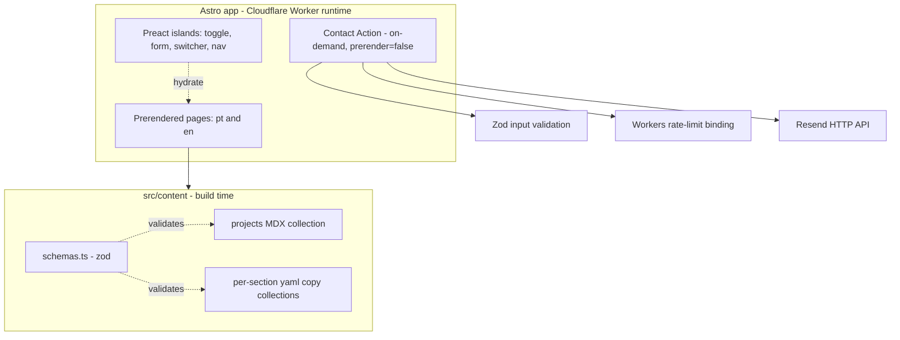
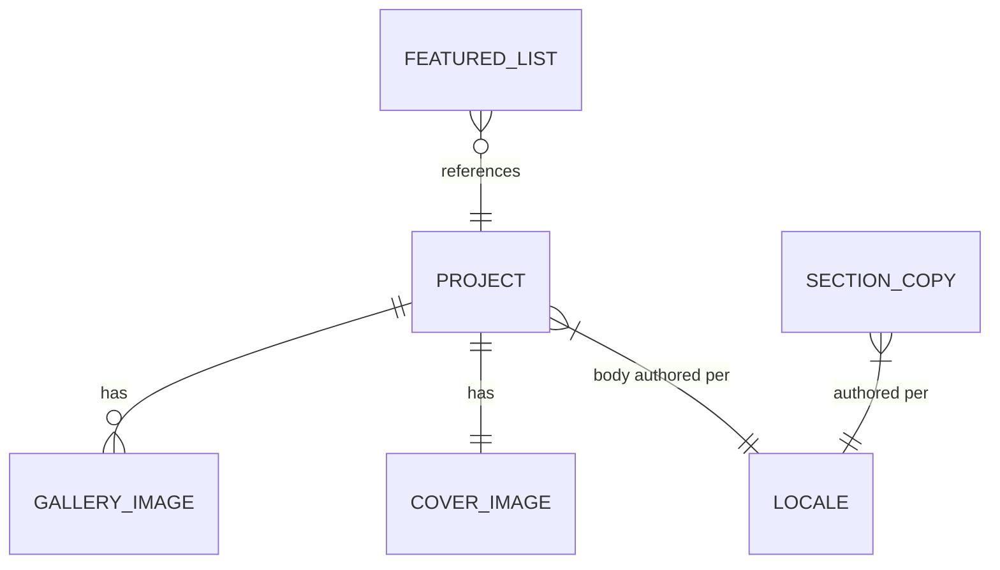

# Design Doc: adeonir.dev Personal Portfolio

## 1. Context & Scope

adeonir.dev is a bilingual (Portuguese default, English secondary) personal
portfolio for a frontend developer positioned on "design + code". It is a
content-first static site — a landing surface, a work index, and per-project
case studies — with a single server touchpoint: a contact form. Performance is
the explicit differentiator: the site itself is the proof of craft, so the
architecture optimizes for near-zero shipped JavaScript and top quality scores.

The surrounding landscape is intentionally small: Cloudflare hosts and runs the
one on-demand route, Resend delivers transactional email, Cloudflare Email
Routing forwards the branded inbox, and Umami Cloud collects cookieless
analytics. There is no database and no backend beyond contact handling.

> See PRD: `docs/product/prd.md`

---

## 2. Goals / Non-Goals

### Goals

- **Performance budget (enforced in CI):** mobile Lighthouse Performance ≥ 95,
  Accessibility 100, Best Practices 100, SEO 100; LCP < 2.0s, CLS < 0.1,
  INP < 200ms. Builds fail when a budget regresses (NFR-1).
- **Near-zero baseline JS:** pages prerender to static HTML; only interactive
  islands hydrate (theme toggle, contact form, language switcher, mobile nav).
- **Accessibility:** WCAG 2.1 AA across all pages, asserted automatically
  (NFR-2).
- **Bilingual-ready delivery:** routing-based i18n (pt at `/`, en at `/en`) with
  localized metadata and `hreflang`. Portuguese ships first; English is a later
  phase (FR-12 is Could Have), so the architecture is built i18n-aware but the en
  locale is enabled once its content is ready (NFR-4).
- **Contact path integrity:** server-side validated submission, two
  transactional emails per submit, spam-guarded, zero persistence; on failure
  the UI surfaces a direct fallback channel (FR-5, EC-2).
- **Safe delivery:** production deploys only after the full test suite passes;
  every PR gets a preview deployment.

### Non-Goals

- **Client-side / runtime language switching** (react-i18next style): rejected —
  it would ship both languages plus a translation layer to the client, breaking
  the performance budget and SEO/hreflang.
- **Persistence layer:** no database; contact submissions are transient.
- **Authentication / sessions:** no logged-in experience.
- **SSR for content pages:** content pages are prerendered; only the contact
  route renders on demand.
- **Browser-language auto-detection:** default is pt; language is changed via an
  explicit switcher.

---

## 3. Architecture

### 3.1 Architecture



- **Components:** Astro app (prerendered pages + one on-demand Action), Preact
  islands, content layer (MDX projects + per-section yaml copy), shared `schemas.ts`.
- **Runtime boundaries:** everything prerenders to static assets except the
  contact Action, which executes on the Cloudflare Worker runtime (workerd).

### 3.2 System Context

```mermaid
flowchart LR
  Visitor[Visitor: client / recruiter / peer] --> CF[Cloudflare Pages edge]
  CF --> App[adeonir.dev Astro app]
  App --> Resend[Resend - transactional email]
  Resend --> Submitter[Confirmation to visitor email]
  Resend --> Inbox[Notification to contato@adeonir.dev]
  Inbox --> Routing[CF Email Routing] --> Gmail[adeonir@gmail.com]
  App --> Umami[Umami Cloud - analytics]
  GH[GitHub Actions CI] --> Deploy[wrangler pages deploy] --> CF
```

- **Actors:** site visitors (the three PRD personas).
- **External services:** Cloudflare Pages (host + edge runtime), Resend
  (outbound transactional email), Cloudflare Email Routing (inbound forward of
  `contato@adeonir.dev` → Gmail), Umami Cloud (analytics), GitHub Actions (CI).

### 3.3 Conventions

- **Files / naming:** all files `kebab-case`; component default export is
  `PascalCase` (`project-card.astro` → `ProjectCard`). Slugs and folders
  `kebab-case`. Routes lowercase.
- **Routing:** `/` (pt home), `/work`, `/work/[slug]`, `/404`; English mirrors
  under `/en/...`. `i18n.routing.prefixDefaultLocale = false`.
- **i18n keys vs tags:** locale keys are `pt` (default, bare) and `en`; emitted
  `lang`/`hreflang` are `pt-BR` and `en` (decoupled from the key). Localized
  links built via `getRelativeLocaleUrl()`.
- **Content layout:** per-section yaml copy collections and a `projects` MDX
  collection live under `src/content/`; default locale is bare (`*.yaml`,
  `index.mdx`), English carries an `.en` suffix (`*.en.yaml`, `index.en.mdx`);
  cover and gallery images are shared across locales.
- **Action contract:** Zod input schema; typed, structured errors; progressive
  enhancement (form posts and works without JS, enhanced by the island).
- **Styling:** Tailwind consuming the existing dual-skin design tokens.
- **Versioning:** N/A — no public API to version.

### 3.4 Domain

- **Bounded contexts:** two — *content* (projects + section copy, build-time,
  read-only) and *contact* (transient inbound message, runtime, write-only to
  email).

| Entity | Purpose | Key Invariants | Storage |
|--------|---------|----------------|---------|
| Project | A case study | `slug` = folder name (unique); pt body (`index.mdx`) required, `index.en.mdx` for en; `cover` present | MDX + colocated images in `src/content/projects/<slug>/` (git, build-time) |
| Section copy | UI text per section per locale | each section has a bare pt file and an `.en` variant; shape validated by its own schema | yaml data collections in `src/content/` (git, build-time) |
| Featured selection | Ordered curation for the home page | references existing project slugs; order is preserved | ordered list in `featured.yaml` (copy) |
| Contact submission | Inbound visitor message | `name`/`email`/`message` validated; rate-limited per IP; never stored or logged | none — transient, delivered via Resend |

- **Lifecycle:** projects are shown everywhere on the work index and on the home
  page when present in the featured list — no stored state. A contact submission
  flows: validate → honeypot + rate-limit check → send two emails → discard.
- **Business rules:** see PRD BR-1 (work is the primary action), BR-2 (every
  shown project routes to a detail surface), BR-3 (contact offers a direct
  channel besides the form).



- **Ubiquitous glossary:** *locale* (pt | en), *island* (a hydrated Preact
  component), *section copy* (UI text for one section, per locale), *project
  entry* (one MDX case study), *featured* (ordered home curation).

### 3.5 Security & Compliance

- **Transport and storage:** HTTPS everywhere (Cloudflare). No data at rest —
  nothing is persisted.
- **PII handling:** the contact form collects `name`, `email`, `message`. These
  are validated, used to compose two emails, and discarded — never stored, never
  written to logs. The visitor's email is set as `Reply-To` on the notification
  so replies route back to them.
- **Auth / Authz:** N/A — no accounts, no protected resources.
- **Spam / abuse:** honeypot field + Cloudflare Workers rate-limit binding
  (5 requests / 10 min per IP, keyed on `CF-Connecting-IP`) + Zod validation.
  Cloudflare Turnstile is held in reserve and added only if spam gets through.
- **Audit log:** N/A — no sensitive or stateful operations to audit.
- **Regulatory (LGPD/GDPR):** analytics is cookieless and aggregate and nothing
  is retained, so no consent banner is required; a lightweight privacy notice
  sits near the form ("your message is emailed to me, not stored"). A standalone
  `/privacy` page is deferred.
- **Secrets:** the Resend API key (and any future tokens) live in Cloudflare env
  / Pages secrets, with `.dev.vars` for local development; never committed.
  Sending domain `adeonir.dev` is verified in Resend via SPF/DKIM/DMARC records
  in Cloudflare DNS.

### 3.6 Observability

- **Metrics:** Umami Cloud (cookieless, ~2 kb) — work views (pageviews of
  project surfaces), contact submissions (custom `track()` event), and UTM
  source/medium/campaign attribution (FR-9).
- **Logging:** Cloudflare Worker logs capture contact Action errors (no PII);
  Resend's dashboard records delivery status. The site is otherwise static and
  log-free.
- **Alerts:** N/A for paging — this is a personal site. Delivery failure is
  surfaced to the visitor in-band (EC-2 fallback to the direct channel) and
  visible in the Resend dashboard.
- **Dashboards:** Umami dashboard (owner) for traffic and goals.
- **Tracing:** N/A — a single edge function with no downstream call graph.

### 3.7 Testing

| Type | Scope | Tools | Coverage Target |
|------|-------|-------|-----------------|
| Unit | Zod schemas, theme/locale utilities | Vitest (node) | Core logic |
| Component | Preact islands (toggle, form, switcher) in a real browser | Vitest browser mode (Playwright provider) | Each island |
| E2E | Contact flow + EC-2 fallback, routing, 404 (EC-3) | Playwright | Critical flows |
| A11y | Rendered pages, WCAG AA | `@axe-core/playwright` | All pages |
| Perf / budget | Quality budgets (see §2) | Lighthouse CI | Key pages |

- **Test environments:** local, plus per-PR Cloudflare preview deployments.
- **Flake handling:** Playwright retries on CI; deterministic selectors.
- **CI integration:** all suites run in GitHub Actions on every PR as a blocking
  gate (see §3.8).

### 3.8 Deployment

- **CI/CD:** GitHub Actions, one pipeline — install → lint (Biome) → typecheck →
  Vitest (+ browser mode) → Playwright → Lighthouse CI → build →
  `wrangler pages deploy`. The deploy job is downstream of the test jobs, so it
  never runs on a red build.
- **Release strategy:** production deploys from `main`; every PR/branch gets a
  preview deployment via `wrangler pages deploy --branch=<name>`.
- **Rendering:** static prerender for all content pages; the contact route is
  `export const prerender = false` and runs on the Cloudflare Worker runtime.
- **Migrations:** N/A — no database.
- **Backups:** all content (MDX + yaml + images) is versioned in git; there is
  no separate data store to back up.
- **Rollback:** redeploy the previous build, or roll back to a prior deployment
  from the Cloudflare Pages dashboard.
- **Environments:** local (`.dev.vars`), PR preview, production.
- **Secrets management:** Cloudflare env / Pages secrets for the Resend key;
  `CLOUDFLARE_API_TOKEN` and `CLOUDFLARE_ACCOUNT_ID` stored as GitHub Actions
  secrets for the deploy step.

---

## 4. Alternatives Considered

| Decision | Chosen | Rejected | Reasoning | Record |
|----------|--------|----------|-----------|--------|
| Framework | Astro (hybrid) | TanStack Start | Content-first site where performance is the message; TanStack Start is an app framework solving a content problem — its loaders/server-fns are app features this site does not need | — |
| Host / rendering | Cloudflare Pages, hybrid | Vercel / Netlify; fully static | Free edge hosting on the workerd runtime with a native ecosystem (Email Routing, rate-limit binding, Pages previews); hybrid keeps the form first-party (one on-demand route) while everything else prerenders. Vercel/Netlify are equally capable; fully static would force the form onto a third party | — |
| Deploy pipeline | Wrangler in GitHub Actions | Cloudflare dashboard git integration | A real test suite should gate deploy directly; in Actions the deploy job is downstream of tests, so red never ships (vs. branch-protection-by-proxy) | — |
| Contact delivery | Resend (2 emails) | CF Email Routing send-binding; D1 persistence | The flow must email the *visitor* (arbitrary address) — the send-binding can only reach verified self-addresses; no DB needed since emails are the record | — |
| Spam defense | Honeypot + Workers rate-limit | Turnstile from day one | Low-volume personal form; Turnstile adds a script + widget that costs perf — reserved until spam is proven | — |
| UI runtime | Preact | React | ~4 tiny islands; Preact gives the same JSX/hooks API at a fraction of the bytes. React appears only via react-email, server-side, never shipped | — |
| Styling | Tailwind | Vanilla CSS; CSS Modules | Existing dual-skin tokens map cleanly to generated utilities; first-class Astro integration | — |
| Content model | Single-source MDX + per-section yaml collections | Split metadata (yaml) from body (MDX) | One source of truth per project; schema-validated; no slug duplication or join logic | — |
| i18n strategy | Routing-based: pt bare, en `/en`, no auto-detect | Client-side (react-i18next style); both-locales-prefixed; browser detection | Keeps the perf budget and SEO/hreflang intact; clean prefix-free URL for the primary (BR) audience | — |
| Analytics | Umami Cloud (free) | Cloudflare Web Analytics | Need custom events (contact submissions) and UTM campaigns, which CF Web Analytics does not cover on free | — |
| E2E testing | Keep Playwright (scoped) | Drop it | Component tests can't exercise the contact Action, routing, or 404 — the only places that can actually break | — |

**Record column:** `—` means the design doc is the only record. No decision has
been promoted to an ADR yet.

---

## 5. Open Questions

- [ ] **Rate-limit binding** — confirm Workers Rate Limiting binding config and
      availability in the deploy target; KV-counter fallback if needed.

---

## 6. References

- PRD: `docs/product/prd.md`
- Astro i18n routing: https://docs.astro.build/en/guides/internationalization/
- ADRs: none yet
