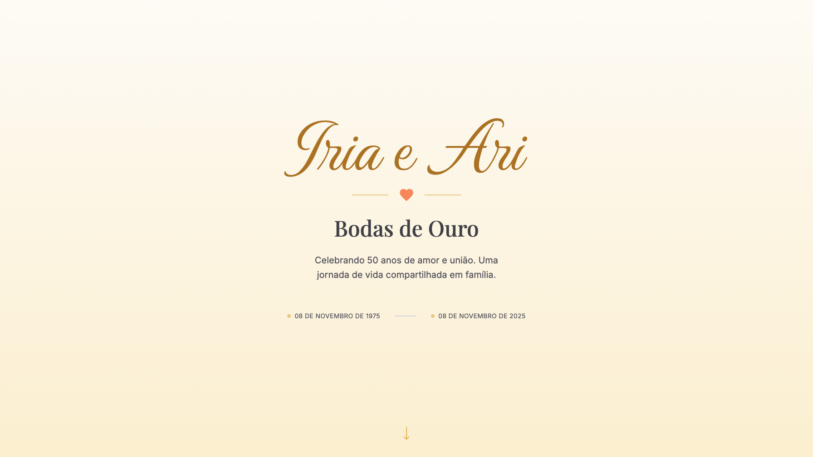

## The context

### Fifty years of history to share with the family

I built the site for my parents' 50th wedding anniversary, open for family and friends to leave messages. The risk was accepting messages from any visitor on a public site. That could expose my family to unwanted content. I built a guestbook where an admin approves every message before it appears, behind token authentication.

The site also has a photo gallery, a timeline of their story, and a countdown to the party. Tests run against an in-memory database, so continuous integration needs no external database.
