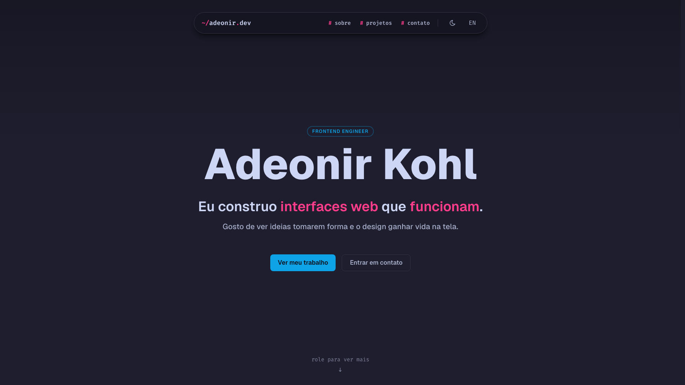

## O contexto

### Um site com a mesma qualidade que entrego no meu trabalho

O site é a minha vitrine, então ele precisa ter a mesma qualidade do trabalho que faço profissionalmente. Construí o site em Astro, e ele roda na Cloudflare. A página inicial é uma one-page, com navegação entre as seções, animações suaves de entrada e layout responsivo.

Está disponível em português e em inglês, com tema claro e escuro. Cada build passa por testes unitários e por uma auditoria do Lighthouse antes de ir ao ar, para checar performance e acessibilidade.
