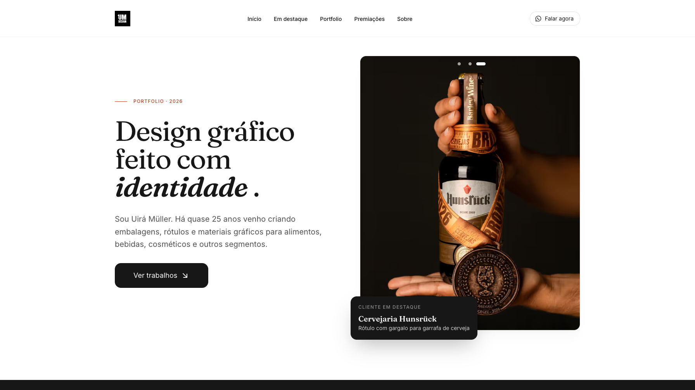

## O contexto

### Um site pesado e com pouco controle sobre o resultado

O site do Uirá era feito no Mobirise, um criador de sites visual. O resultado era pesado, difícil de atualizar e com pouco controle sobre o código, o visual e a performance. Refiz o site como uma única página estática em Astro, com algumas partes em React.

O conteúdo fica em YAML estruturado, e o Zod valida esse conteúdo durante o build. Assim o site não precisa de CMS, banco de dados nem backend. Ele carrega rápido e leva o visitante direto para o WhatsApp. Eu atualizo o conteúdo com um simples commit. Além disso, o site não coleta dados pessoais.
